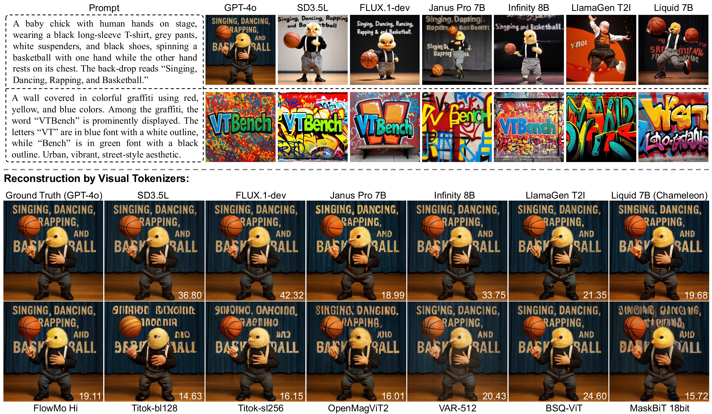
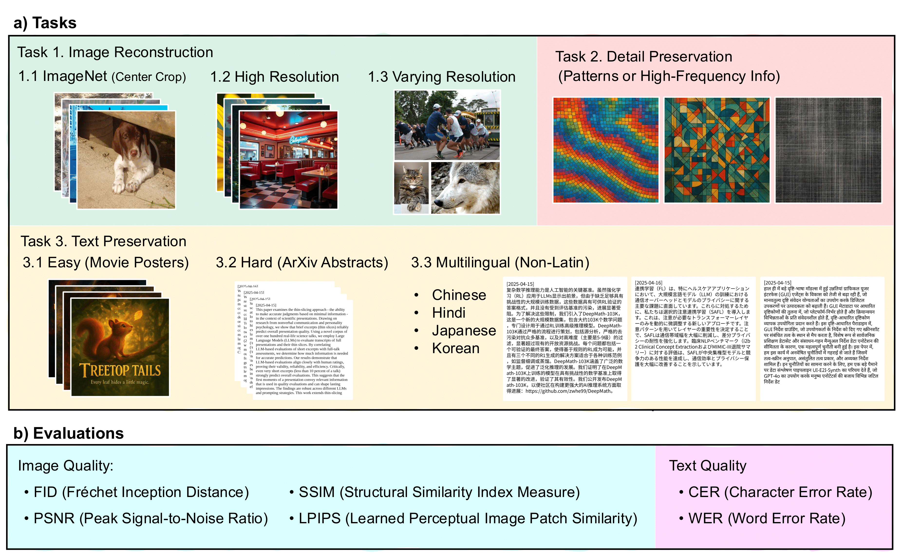

# VTBench: Evaluating Visual Tokenizers for Autoregressive Image Generation
<div align="center">
  
[](https://huggingface.co/datasets/huaweilin/VTBench)&nbsp;
[](https://huggingface.co/spaces/huaweilin/VTBench)&nbsp;
[](https://github.com/huawei-lin/VTBench/tree/main)&nbsp;
[](https://arxiv.org/abs/2505.13439)


</div>


This repository provides the official implementation of **VTBench**, a benchmark designed to evaluate the performance of **visual tokenizers (VTs)** in the context of **autoregressive (AR) image generation**. VTBench enables fine-grained analysis across three core tasks: **image reconstruction**, **detail preservation**, and **text preservation**, isolating the tokenizer's impact from the downstream generation model.

Our goal is to encourage the development of **strong, general-purpose open-source visual tokenizers** that can be reliably reused across autoregressive image generation and broader multimodal tasks.

## 🔥 News

- **May 19, 2025** Our paper is now available on arXiv! [Read it here](https://arxiv.org/abs/2505.13439)
- **May 18, 2025:** We released the [demo on huggingface space](https://huggingface.co/spaces/huaweilin/VTBench)! Pick your favorite image and try out over 20+ visual tokenizers. [[link](https://huggingface.co/spaces/huaweilin/VTBench)]


## 🔍 Why VTBench?

Recent AR models such as GPT-4o demonstrate impressive image generation quality, which we hypothesize is made possible by a **highly capable visual tokenizer**. However, most existing VTs significantly lag behind **continuous VAEs**, leading to:

- Poor reconstruction fidelity  
- Loss of structural and semantic detail  
- Failure to preserve symbolic information (e.g., text in multilingual images)

VTBench isolates and evaluates VT quality, independent of the downstream model, using standardized tasks and metrics.




## ✨ Features

- Evaluation on **three tasks**:
  1. **Image Reconstruction** (ImageNet, High-Res, Varying-Res)
  2. **Detail Preservation** (patterns, fine textures)
  3. **Text Preservation** (posters, academic abstracts, multilingual scripts)
- Supports VTs from models like **FlowMo**, **MaskBiT**, **OpenMagViT2**, **VAR**, **BSQ-ViT**, etc.
- Includes baselines from **continuous VAEs** (e.g., SD3.5L, FLUX.1) and GPT-4o.
- Metrics: PSNR, SSIM, LPIPS, FID, CER, WER
- ✅ **Automatic download of all datasets and models** -- no manual setup required.



## 📑 Open-Source Plan
- [x] Huggingface Space Demo
- [x] VTBench arXiv Paper
- [x] Evaluation Code
- [x] Inference Code on Supported VTs
- [x] VTBench Dataset


## 🚀 Getting Started

### 1. Clone the repo
```bash
git clone https://github.com/huawei-lin/VTBench.git
cd VTBench
```

### 2. Install dependencies
```
conda create -n vtbench python=3.10
conda activate vtbench
pip install -r requirements.txt
```

### 3. Select a VT and Run Evaluation

> ✅ **No Manual Downloads Needed**  
All datasets and models are automatically downloaded during runtime from Hugging Face. You can directly run experiments without manually downloading any files.

#### 📦 Model Zoo
| Code Name           | Display Name      |
| ------------------- | ----------------- |
| `bsqvit`            | BSQ-VIT           |
| `chameleon`         | Chameleon         |
| `FLUX.1-dev`        | FLUX.1-dev        |
| `flowmo_hi`         | FlowMo Hi         |
| `flowmo_lo`         | FlowMo Lo         |
| `gpt4o`             | GPT-4o            |
| `infinity_d32`      | Infinity-d32      |
| `infinity_d64`      | Infinity-d64      |
| `janus_pro_1b`      | Janus Pro 1B/7B   |
| `llamagen-ds8`      | LlamaGen ds8      |
| `llamagen-ds16`     | LlamaGen ds16     |
| `llamagen-ds16-t2i` | LlamaGen ds16 T2I |
| `maskbit_16bit`     | MaskBiT 16bit     |
| `maskbit_18bit`     | MaskBiT 18bit     |
| `open_magvit2`      | OpenMagViT        |
| `SD3.5L`            | SD3.5L            |
| `titok_b64`         | Titok-b64         |
| `titok_bl128`       | Titok-bl128       |
| `titok_bl64`        | Titok-bl64        |
| `titok_l32`         | Titok-l32         |
| `titok_s128`        | Titok-s128        |
| `titok_sl256`       | Titok-sl256       |
| `var_256`           | VAR-256           |
| `var_512`           | VAR-512           |

#### 📚 Dataset
VTBench datasets are available on Hugging Face: https://huggingface.co/datasets/huaweilin/VTBench
| Dataset Name                  | Split Name     |
|------------------------------|----------------|
| task1-imagenet               | val            |
| task1-high-resolution        | test           |
| task1-varying-resolution     | test           |
| task2-detail-preservation    | test           |
| task3-movie-posters          | test           |
| task3-arxiv-abstracts        | test           |
| task3-multilingual           | Chinese, Hindi, Japanese, Korean        |

Run an experiment:
```
accelerate launch --num_processes=1 main.py \
    --model_name chameleon \
    --dataset_name task3-movie-posters \
    --split_name test \
    --output_dir results \
    --batch_size 4
```

The script will create the following directory:
```
results/
├── original_images/
├── reconstructed_images/
└── results/
```

## 📊 Evaluate results
```
python ./evaluations/evaluate_images.py \
    --original_dir results/original_images \
    --reconstructed_dir results/reconstructed_images/ \
    --metrics fid ssim psnr lpips cer wer \
    --batch_size 16 \
    --num_workers 8
```
> ℹ️ Note: cer and wer are only available in text-based reconstruction tasks.

## GPT-4o Support
To use GPT-4o for generation:
```
export OPENAI_API_KEY=${your_openai_key}
```

## 🛠️ Automation
We provide automation scripts in `examples`. Simply run:
```
bash ./examples/run.sh
```
For SLURM users, adapt `examples/submit.sh` accordingly and uncomment the SLURM section in `run.sh`.

## Citation

If you find this project useful, please consider citing:
```
@article{vtbench,
  author       = {Huawei Lin and
                  Tong Geng and
                  Zhaozhuo Xu and
                  Weijie Zhao},
  title        = {VTBench: Evaluating Visual Tokenizers for Autoregressive Image Generation},
  journal      = {arXiv preprint arXiv:2502.01634},
  year         = {2025}
}
```
